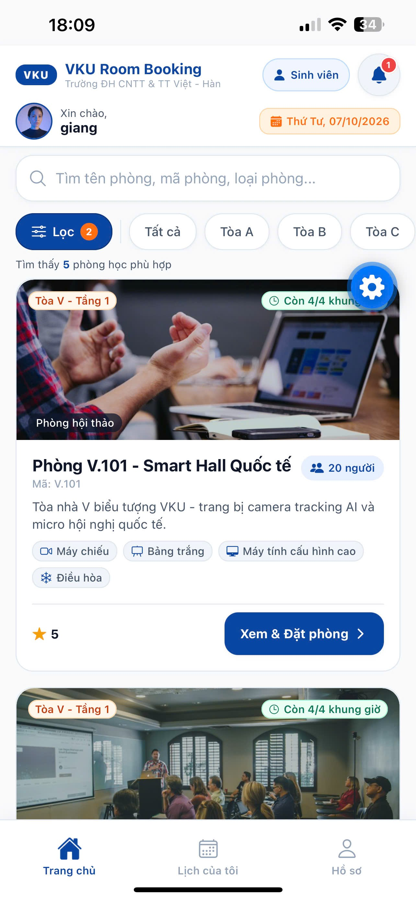
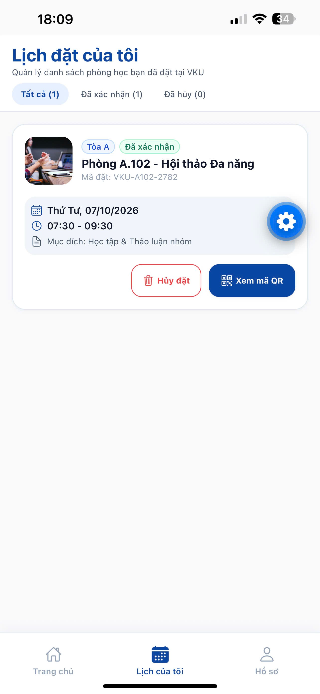
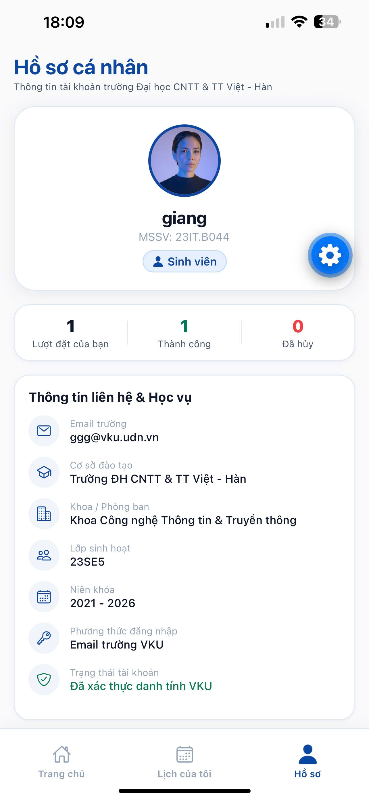
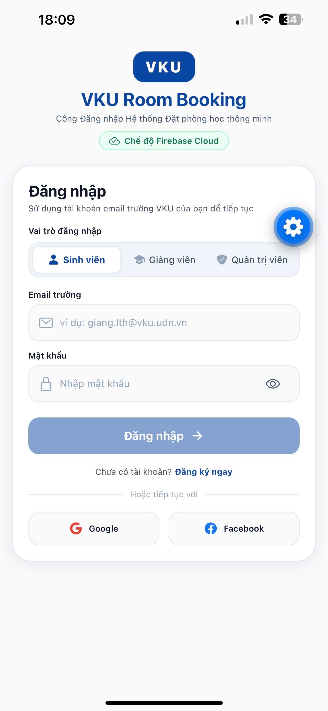
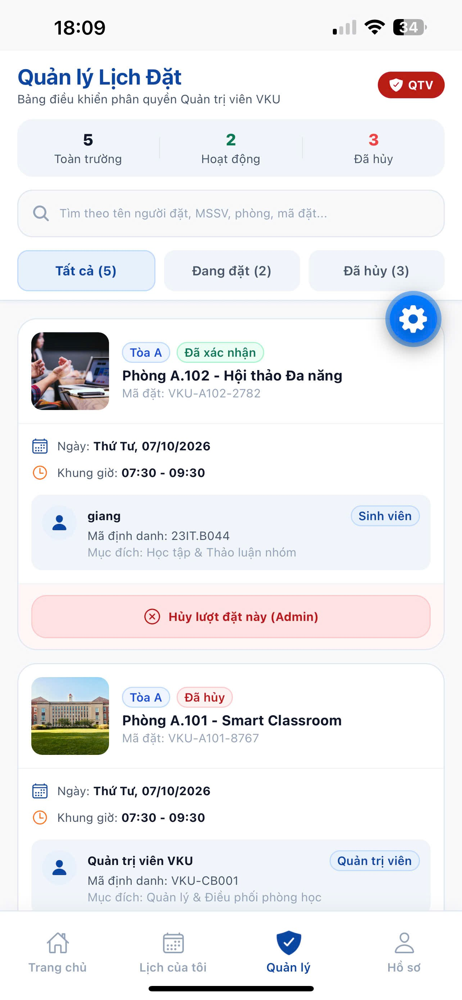
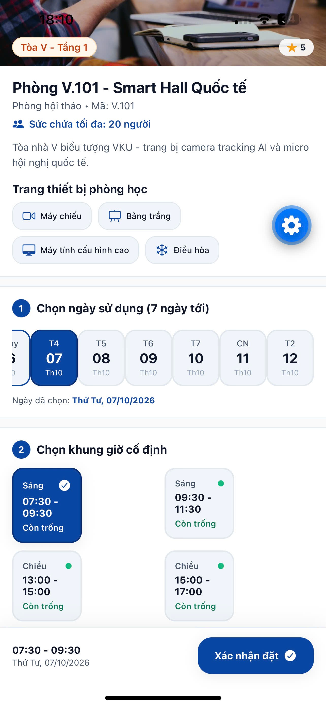
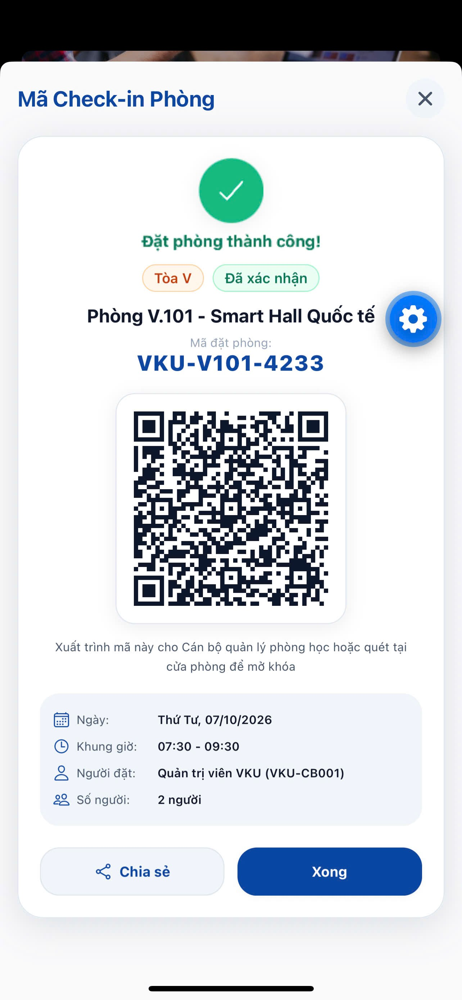
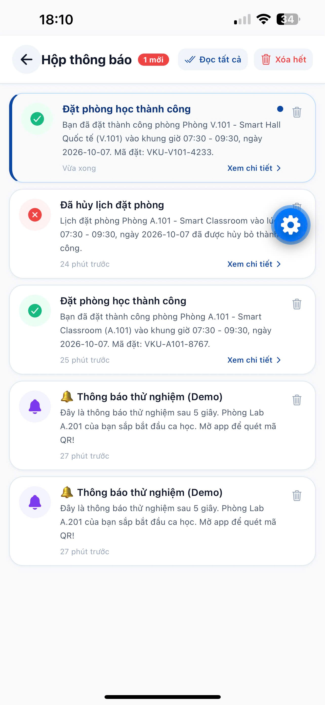

# MINI-PROJECT SHORT TECHNICAL REPORT
**Course:** Cross-Platform Mobile App Development (VKU)
**Mini-Project Title:** [Mini-Project 2]
**Team / Student Name:** [Lê Thị Hương Giang]
**Submission Date:** [06/10/2026]

---

## 1. GENERAL INFORMATION & DELIVERABLE LINKS
* **Team Members:**
  1. [Lê Thị Hương Giang] — Student ID: [23IT.B044] — Role: [Team Lead ] — Contribution: [100%]
* **🔗 Live Demo URL:** [https://drive.google.com/drive/folders/1cciopovq4GeGucA1vJTGrjxpUDnIPS7S?usp=sharing]
* **💻 GitHub Repository:** [https://github.com/username/your-repo-name]
* **🎥 Video Demo (Optional):** [https://drive.google.com/drive/folders/1cciopovq4GeGucA1vJTGrjxpUDnIPS7S?usp=sharing]
---

## 2. FEATURE IMPLEMENTATION CHECKLIST

| # | Required Feature | Status | Implementation Details & Acceptance Level |
|:---:|---|:---:|---|
| 1 | Responsive Mobile Viewport | ✅ Complete | Tối ưu cho khung nhìn di động chuẩn (390 x 844 px), chạy mượt trên Trình duyệt Web, iOS và Android (Expo Go). Xử lý an toàn khoảng đệm tai thỏ và thanh Home Indicator qua `react-native-safe-area-context`, bàn phím qua `KeyboardAvoidingView`. |
| 2 | Local Offline Persistence | ✅ Complete | Lưu trữ bền vững cục bộ bằng Zustand v5 kết hợp middleware `persist` vào `@react-native-async-storage/async-storage`. Tự động lưu: phiên người dùng (`currentUser`), toàn bộ lượt đặt phòng (`bookings`), hộp thông báo (`notifications`), danh sách tài khoản demo (mật khẩu băm SHA-256 + salt) và token phiên qua `expo-secure-store` / `AsyncStorage`. |
| 3 | Automatic Background Sync | ❌ Not done | **Chưa** triển khai hàng đợi payload offline (outbox queue) và tiến trình chạy ngầm tự đồng bộ lên máy chủ khi có mạng trở lại (chưa tích hợp `@react-native-community/netinfo` hay Sync Worker). Thao tác đặt phòng hiện ghi trực tiếp vào cache/local store. |
| 4 | Đăng ký tài khoản (Register) | ✅ Complete | Form đầy đủ (Họ tên, Email trường `@vku.udn.vn`, MSSV/Mã GV, Lớp, Khoa, Mật khẩu có thanh đo độ mạnh). Chặn client tự tạo vai trò `admin`. Đăng ký xong **không tự đăng nhập**: gọi `signOut()`, điều hướng về `LoginScreen` với email điền sẵn và thông báo thành công màu xanh lá. Có rollback tự động xóa tài khoản Auth mồ côi nếu lưu Firestore thất bại. |
| 5 | Đăng nhập Email & Mật khẩu | ✅ Complete | Xác thực qua Firebase Authentication (`signInWithEmailAndPassword`) và đọc hồ sơ `users/{uid}` trên Cloud Firestore. Tự chuyển sang `LocalAuthService` (băm SHA-256 + salt ngẫu nhiên) khi offline hoặc thiếu `.env`. |
| 6 | Đăng nhập Google (Nền tảng Web) | ✅ Complete | Dùng JS SDK `firebase/auth` (`signInWithPopup` + `GoogleAuthProvider` + `browserPopupRedirectResolver`). Lần đầu tự tạo hồ sơ Firestore với vai trò đang chọn (`student` hoặc `lecturer`), chặn `admin` ("Tài khoản Quản trị viên chỉ được cấp qua console"). Giữ nguyên vai trò nếu tài khoản đã tồn tại. Dịch đủ 5 mã lỗi popup sang tiếng Việt. Trên Expo Go (iOS/Android) hiển thị thông báo chỉ hỗ trợ trên web. |
| 7 | Bộ chọn vai trò & Đối chiếu vai trò nghiêm ngặt | ✅ Complete | Bộ chọn 3 nút phân đoạn (Sinh viên, Giảng viên, Quản trị viên) phía trên ô email. Vai trò chọn **chỉ dùng để đối chiếu**, không dùng để cấp quyền. Sau đăng nhập, nếu `profile.role` khác vai trò đang chọn thì gọi `signOut()`, chặn vào app và báo lỗi: *"Tài khoản này thuộc vai trò [Tên vai trò]. Vui lòng chọn đúng vai trò để đăng nhập."* Áp dụng cho cả Firebase và chế độ cục bộ. |
| 8 | Phân quyền Quản trị viên (Admin) | ✅ Complete | Ba vai trò rõ ràng (`student`, `lecturer`, `admin`). Đã loại bỏ nút demo và mật khẩu hardcoded; tài khoản Admin chỉ tạo thủ công trên Firebase Console. Có `AdminScreen`: giám sát toàn bộ phòng, xem lịch đặt toàn trường, lọc theo tòa/ngày, duyệt và hủy lượt đặt. |
| 9 | Cloud Firestore Security Rules | ✅ Complete | `firestore.rules`: mỗi người chỉ đọc/ghi hồ sơ của chính mình tại `/users/{userId}` (`request.auth.uid == userId`); khi tạo bắt buộc `role in ['student', 'lecturer']`; khi cập nhật cấm sửa `role`; cấm client xóa hồ sơ; từ chối (deny all) các collection khác. |
| 10 | Lưu & Khôi phục phiên (Session Persistence) | ✅ Complete | Di động: lưu phiên Firebase Auth qua `AsyncStorage` (`getReactNativePersistence`); web: `browserLocalPersistence`. Tự khôi phục phiên (`restoreSession`) khi khởi động, kèm màn hình chờ Splash loader. |
| 11 | Kiến trúc Chế độ kép (Dual-Mode) | ✅ Complete | Theo Dependency Inversion với interface `AuthService`. Có `.env` đầy đủ thì dùng `FirebaseAuthService` (Cloud); thiếu biến môi trường thì fallback `LocalAuthService` (Offline Demo) kèm huy hiệu thông báo, đảm bảo chạy ổn ngay sau khi clone mà không lỗi thiếu API key. |
| 12 | Tra cứu & Bộ lọc phòng học đa tiêu chí | ✅ Complete | Tìm theo tên/mã phòng; lọc theo tòa (A, B, C, V), sức chứa tối thiểu, trang thiết bị (Máy chiếu, Bảng trắng, Máy tính cấu hình cao, Điều hòa), trạng thái (Còn trống / Đã đặt) theo ngày chọn. Thẻ phòng hiển thị "Còn x/4 khung giờ" và nhãn thời gian thực ("Available Now / Occupied"). |
| 13 | Chọn ngày & Khung giờ chuẩn VKU | ✅ Complete | Chọn ngày trong 7 ngày tới. 4 khung giờ chuẩn (07:30–09:30, 09:30–11:30, 13:00–15:00, 15:00–17:00). Kiểm tra atomic, tự vô hiệu hóa khung giờ đã có người đặt để chống trùng lịch. |
| 14 | Đặt phòng & Mã QR Check-in | ✅ Complete | TanStack Query Mutation (`createBookingApi`, mô phỏng độ trễ 500ms) kết hợp Zustand store. Tự sinh mã đặt phòng (VD: `VKU-A101-7821`). Tạo QR SVG bằng `react-native-qrcode-svg` trên modal check-in. |
| 15 | Lịch của tôi & Hủy phòng | ✅ Complete | `MyBookingsScreen` lọc theo tài khoản hiện tại với 3 tab: Đang hoạt động, Đã hoàn thành, Đã hủy. Hủy đặt phòng chuyển trạng thái `cancelled`, giải phóng khung giờ và tự hủy thông báo nhắc nhở đã lên lịch. |
| 16 | Hộp thông báo & Push Notifications | ✅ Complete | Chuông trên Header kèm badge đỏ đếm chưa đọc ("9+" nếu > 9). `NotificationsScreen` hỗ trợ xem chi tiết, đánh dấu đã đọc, xóa từng mục, xóa tất cả. Dùng `expo-notifications`: tự lên lịch nhắc nhận phòng trước 15 phút, có nút gửi thông báo thử sau 5 giây trong màn hình Hồ sơ. |
| 17 | UI/UX & Micro-Animations | ✅ Complete | Hiệu ứng trượt và mờ dần cho thẻ phòng bằng `react-native-reanimated` v4 (tối ưu 8 thẻ đầu để giữ 60fps). Nút bấm có hiệu ứng scale spring kèm rung `expo-haptics`. Giao diện đồng bộ nhờ hệ thống design token. |

---

## 3. TECHNICAL ARCHITECTURE & PROJECT STRUCTURE

### 3.1. Công nghệ sử dụng

| Nhóm | Công nghệ |
|---|---|
| Môi trường & Nền tảng | Expo SDK 57 (`~57.0.26`), React Native `0.86.3`, React `19.2.3`, TypeScript (`"strict": true`) |
| Điều hướng | React Navigation v7 (`@react-navigation/native` ^7.5.0, `native-stack` ^7.20.0, `bottom-tabs` ^7.20.0) |
| Client State | Zustand v5 (`^5.0.15`) + middleware `persist` lưu vào `@react-native-async-storage/async-storage` |
| Server State Cache | TanStack React Query v5 (`^5.104.1`) với `useQuery` / `useMutation`, mô phỏng độ trễ mạng qua `src/api/roomApi.ts` |
| Cloud (Auth & DB) | Firebase JS SDK v12 (`^12.19.0`): Authentication (`signInWithEmailAndPassword`, `createUserWithEmailAndPassword`, `signInWithPopup`, `GoogleAuthProvider`, `browserPopupRedirectResolver`) và Cloud Firestore (`doc`, `getDoc`, `setDoc`) |
| Tiện ích & Giao diện | `expo-crypto` (SHA-256), `expo-secure-store` (khóa phiên), `expo-notifications` (thông báo hẹn giờ), `expo-haptics` (rung), `react-native-reanimated` v4 (animation), `react-native-qrcode-svg` (mã QR) |

### 3.2. Cấu trúc thư mục thực tế

```text
vku-room-booking/
├── .env.example                          # Mẫu biến môi trường EXPO_PUBLIC_FIREBASE_*
├── firestore.rules                       # Quy tắc bảo mật Firestore phân quyền theo role
└── src/
    ├── api/                              # Tầng API & cấu hình TanStack Query
    │   ├── queryClient.ts                # QueryClient dùng chung
    │   └── roomApi.ts                    # API giả lập: fetchRoomsApi, fetchRoomByIdApi, createBookingApi
    ├── components/                       # Component UI tái sử dụng
    │   ├── AppPressable.tsx              # Nút bấm: hiệu ứng Reanimated + rung Haptics
    │   ├── FilterBar.tsx                 # Chip lọc tòa nhà + nút mở bộ lọc nâng cao
    │   ├── Header.tsx                    # Thông tin người dùng + chuông thông báo
    │   ├── NotificationBell.tsx          # Chuông kèm badge đỏ đếm chưa đọc
    │   └── RoomCard.tsx                  # Thẻ phòng: slot, nhãn thời gian thực, animation
    ├── constants/
    │   └── authConstants.ts              # ROLE_LABELS, mô tả vai trò, danh sách khoa, học vị
    ├── data/
    │   └── mockRooms.ts                  # 12 phòng học mẫu tòa A, B, C, V của VKU
    ├── hooks/
    │   ├── useNotificationLifecycle.ts   # Lắng nghe và xử lý click thông báo
    │   └── useNotifications.ts           # Xin quyền và lên lịch thông báo nhắc nhở
    ├── navigation/
    │   └── RootNavigator.tsx             # Root Stack, Auth Stack và Main Bottom Tabs (4 tab)
    ├── screens/                          # 9 màn hình chính
    │   ├── AdminScreen.tsx               # Quản trị: giám sát phòng, duyệt/hủy lịch đặt
    │   ├── HomeScreen.tsx                # Trang chủ: tra cứu, lọc, duyệt phòng
    │   ├── LoginScreen.tsx               # Đăng nhập: chọn vai trò, form email, Google popup web
    │   ├── MyBookingsScreen.tsx          # Lịch của tôi: quản lý và hủy đặt phòng
    │   ├── NotificationsScreen.tsx       # Hộp thông báo: đánh dấu đọc, xóa
    │   ├── ProfileScreen.tsx             # Hồ sơ cá nhân, đổi phiên demo, gửi thông báo thử
    │   ├── QRCodeModalScreen.tsx         # Modal mã QR check-in
    │   ├── RegisterScreen.tsx            # Đăng ký: chọn vai trò, nhập thông tin, đo độ mạnh mật khẩu
    │   └── RoomDetailScreen.tsx          # Chi tiết phòng: chọn ngày, chọn slot, xác nhận đặt
    ├── services/
    │   ├── auth/                         # Module Authentication (Dependency Inversion)
    │   │   ├── AuthService.ts            # Interface: RegisterDTO, LoginDTO, ProviderLoginDTO, AuthService
    │   │   ├── FirebaseAuthService.ts    # Firebase Auth + Firestore users/{uid}
    │   │   ├── LocalAuthService.ts       # Offline Demo: SHA-256 + salt, lưu AsyncStorage
    │   │   └── index.ts                  # getAuthService(), setAuthService(), isAuthFirebaseMode()
    │   └── firebase.ts                   # Khởi tạo Firebase App, Auth persistence (web/mobile), Firestore
    ├── store/                            # Zustand v5 (persist)
    │   ├── useAuthStore.ts               # Trạng thái xác thực, phiên đăng nhập, bắt lỗi auth
    │   ├── useBookingStore.ts            # Danh sách đặt phòng, bộ lọc, tính slot trống
    │   └── useNotificationStore.ts       # Danh sách thông báo, trạng thái đã đọc, số chưa đọc
    ├── theme/
    │   └── index.ts                      # Bảng màu VKU, typography, shadows
    ├── types/
    │   └── index.ts                      # Room, Booking, User, UserRole, TimeSlot, NavigationParams
    └── utils/
        ├── dateUtils.ts                  # Xử lý ngày tháng, sinh mã đặt phòng duy nhất
        └── notificationService.ts        # Cấu hình channel và gửi thông báo qua expo-notifications
```

### 3.3. Luồng dữ liệu và Quản lý trạng thái

**Luồng Xác thực & Phân quyền**
1. UI (`LoginScreen`, `RegisterScreen`) chỉ tương tác qua `useAuthStore` (Zustand).
2. `useAuthStore` gọi `getAuthService()`; tùy biến môi trường sẽ dùng `FirebaseAuthService` (Cloud) hoặc `LocalAuthService` (Offline).
3. Đăng nhập thành công thì phiên người dùng được đồng bộ sang `useBookingStore.setState({ currentUser: user })` để cập nhật quyền truy cập cho các màn hình đặt phòng và quản trị.

**Luồng Dữ liệu Phòng & Đặt phòng**
1. `HomeScreen` dùng `useQuery(['rooms'])` gọi `fetchRoomsApi()` (mô phỏng độ trễ 450ms). Dữ liệu được cache, có trạng thái loading và error riêng.
2. `RoomDetailScreen` kích hoạt `useMutation(createBookingApi)`. Khi thành công, bản ghi mới được thêm vào `bookings` trong `useBookingStore` theo cơ chế atomic (chống xung đột khung giờ) và tự persist vào `AsyncStorage`.

**Luồng Thông báo & Nhắc nhở**
1. Đặt phòng thành công thì `useNotificationStore.addNotification` lưu thông báo loại `booking_confirmed`.
2. Đồng thời `scheduleBookingReminder` (`expo-notifications`) lên lịch thông báo trước giờ nhận phòng 15 phút.
3. Badge chưa đọc trên Header cập nhật theo thời gian thực nhờ selector của Zustand.

### 3.4. Chiến lược Xử lý Ngoại lệ

* **Bản địa hóa mã lỗi Firebase:** hàm `translateFirebaseError` ánh xạ các mã lỗi Auth và Firestore (`auth/invalid-credential`, `auth/email-already-in-use`, `auth/popup-closed-by-user`, `auth/popup-blocked`, `auth/unauthorized-domain`, `permission-denied`...) thành thông điệp tiếng Việt thân thiện.
* **Rollback tài khoản Auth mồ côi:** trong `FirebaseAuthService.register`, nếu tạo tài khoản Auth thành công nhưng ghi hồ sơ `users/{uid}` thất bại (do mạng hoặc vi phạm Firestore Rules), hệ thống gọi `deleteUser` xóa tài khoản vừa tạo và `signOut()`, tránh để lại tài khoản không có hồ sơ.
* **Cờ khóa `isRegistering`:** vì `createUserWithEmailAndPassword` tự đăng nhập phía client, service đặt `isRegistering = true` để tạm khóa `onAuthStateChanged` và `restoreSession`, sau đó gọi `signOut(auth)` rồi nhả cờ. Nhờ vậy app không bị nháy màn hình và người dùng về đúng màn hình Đăng nhập.
* **Đối chiếu vai trò nghiêm ngặt:** khi đăng nhập bằng Email hoặc Google Web, service đọc vai trò từ Firestore và so với vai trò đang chọn. Không khớp thì `signOut()` ngay, không cho `useAuthStore` đặt user, và hiển thị lỗi yêu cầu chọn đúng vai trò.
* **Phòng vệ khi chạy Offline (Dual-Mode Fallback):** `isFirebaseConfigured()` kiểm tra biến môi trường. Thiếu khóa trong `.env` thì app chuyển sang `LocalAuthService` (SHA-256 + salt qua `expo-crypto`) và hiện huy hiệu "Chế độ demo/offline", tránh crash do thiếu cấu hình khi chạy thử hoặc chấm điểm.

---

## 4. EMPIRICAL EVIDENCE & SCREENSHOTS









---

## 5. TECHNICAL CHALLENGES & RESOLUTIONS
* *Lỗi auth/argument-error khi đăng nhập Google trên web: nguyên nhân thiếu popupRedirectResolver với initializeAuth, cách sửa là truyền resolver.*
* *Google không chạy được trong Expo Go: redirect URI exp:// không được chấp nhận, nên giới hạn Google ở web.*
* *createUserWithEmailAndPassword tự đăng nhập: xử lý bằng cờ isRegistering và signOut sau khi lưu hồ sơ.*
